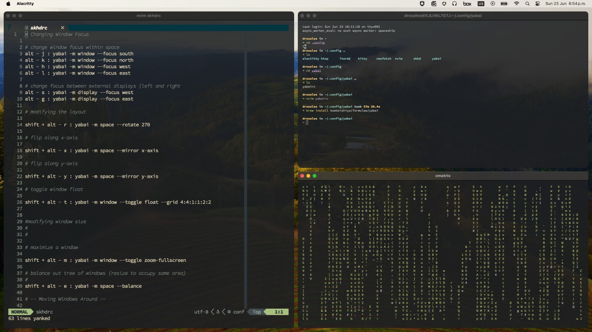

# Config files for Yabai and SKHD

This is my configuration for [Yabai](https://github.com/koekeishiya/yabai "Tiling Window Manager specialized for MacOS") and [SKHD](https://github.com/koekeishiya/skhd "Simple hotkey daemon for macOS")

It is completely based on Josean Martinez config.



# Installation

```bash
  brew install koekeishiya/formulae/yabai

  yabai --start-service
  yabai --restart-service
```

```bash
  brew install koekeishiya/formulae/skhd
  skhd --start-service
  skhd --restart-service

```

# Usage


#### Change window focus within space


| |      | Description                |
| :-------- | :------- | :------------------------- |
| `option` | `j` | **focus** south windows |

| `option` | `k` | **focus** north windows |
| `option` | `h` | **focus** west windows |
| `option` | `l` | **focus** east windows |

#### Change focus between external displays (left and right)

| |      | Description                |
| :-------- | :------- | :------------------------- |
| `option` | `s` | **focus** west display |
| `option` | `g` | **focus** east display |

#### Modifying the layout


| |      | |Description                |
| :-------- | :------- |  :------- |:------------------------- |
| `shift` | `alt` | `r` | **rotate** |
| `shift` | `alt` |`x` | **flip** along x-axis |
| `shift` | `alt` |`y` | **flip** along y-axis |
| `shift` | `alt` |`t` | **toggle** window float |


#### Modifying window size

| |      | |Description                |
| :-------- | :------- |  :------- |:------------------------- |
| `shift` | `alt` | `m` | **toggle** zoom-fullscreen |
| `shift` | `alt` |`e` | **balance** out tree of windows (resize to occupy same area) |

## Moving windows arround 
### swap windows

| |      | |Description                |
| :-------- | :------- |  :------- |:------------------------- |
| `shift` | `alt` | `j` | **swap** south|
| `shift` | `alt` |`k` | **swap** north |
| `shift` | `alt` |`h` | **swap** west |

| `shift` | `alt` |`l` | **swap** east |

### move window and split

| |      | |Description                |
| :-------- | :------- |  :------- |:------------------------- |
| `shift` | `alt` | `j` | **warp** south|
| `shift` | `alt` |`k` | **warp** north |

| `shift` | `alt` |`h` | **warp** west |
| `shift` | `alt` |`l` | **warp** east |


### move window to space #

| |      | |Description                |

| :-------- | :------- |  :------- |:------------------------- |
| `shift` | `alt` | `1` | **move** to space 1|
| `shift` | `alt` | `2` | **move** to space 2|

| `shift` | `alt` | `3` | **move** to space 3|
| `shift` | `alt` | `4` | **move** to space 4|
| `shift` | `alt` | `5` | **move** to space 5|
| `shift` | `alt` | `6` | **move** to space 6|

| `shift` | `alt` | `7` | **move** to space 7|


